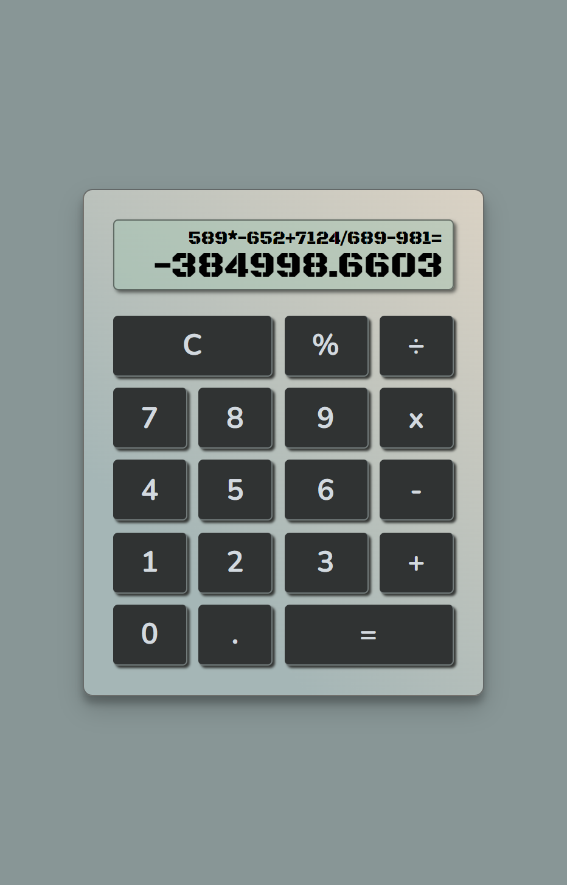

# Overview

Basic Calculator is a web application that provides a simple calculator interface for performing basic mathematical operations. This calculator utilizes formula logic and observes the order of operation precedence. The app follows a set of **user stories** to ensure the required functionality is implemented correctly:

-   [ ] The calculator should contain a clickable element containing an = (equal sign) with a corresponding id="equals".
-   [ ] The calculator should contain 10 clickable elements containing one number each from 0-9, with the following corresponding IDs: id="zero", id="one", ..., id="nine".
-   [ ] The calculator should contain 4 clickable elements each containing one of the 4 primary mathematical operators with the following corresponding IDs: id="add", id="subtract", id="multiply", id="divide".
-   [ ] The calculator should contain a clickable element containing a . (decimal point) symbol with a corresponding id="decimal".
-   [ ] The calculator should contain a clickable element with an id="clear".
-   [ ] The calculator should contain an element to display values with a corresponding id="display".
-   [ ] Pressing the clear button at any time should clear the input and output values, returning the calculator to its initialized state. The element with the id="display" should show 0.
-   [ ] As I input numbers, I should be able to see my input in the element with the id="display".
-   [ ] In any order, I should be able to add, subtract, multiply and divide a chain of numbers of any length, and when I hit =, the correct result should be shown in the element with the id="display".
-   [ ] When inputting numbers, my calculator should not allow a number to begin with multiple zeros.
-   [ ] When the decimal element is clicked, a . should append to the currently displayed value; two . in one number should not be accepted.
-   [ ] I should be able to perform any operation (+, -, \*, /) on numbers containing decimal points.
-   [ ] If 2 or more operators are entered consecutively, the last operator entered (excluding the negative (-) sign) should be the operation performed.
-   [ ] Pressing an operator immediately following = should start a new calculation that operates on the result of the previous evaluation.
-   [ ] The calculator should round calculations with several decimal places of precision (at least 4 decimal places)

The app is deployed at the following link: **https://easy-calculation.onrender.com**.

## Technologies

HTML, JS, React, SASS/SCSS.

## Appearance

## How to launch locally

In the project directory you should:

-   Install dependencies

    `npm install`

-   Start the project

    `npm run dev`

Runs the app in development mode.\
Open [http://localhost:5173](http://localhost:5173) to view it in your browser.

The page will reload when you make changes.\
You may also see any lint errors in the console.

## Acknowledgements

The Technotes project is inspired by the FreeCodeCamp "Build a JavaScript Calculator" challenge.
